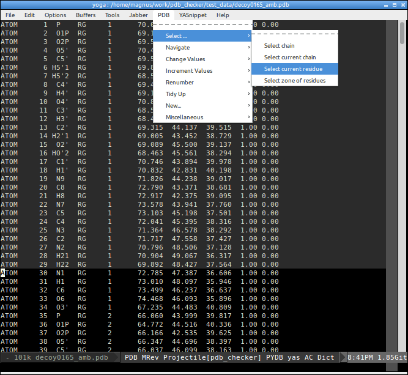
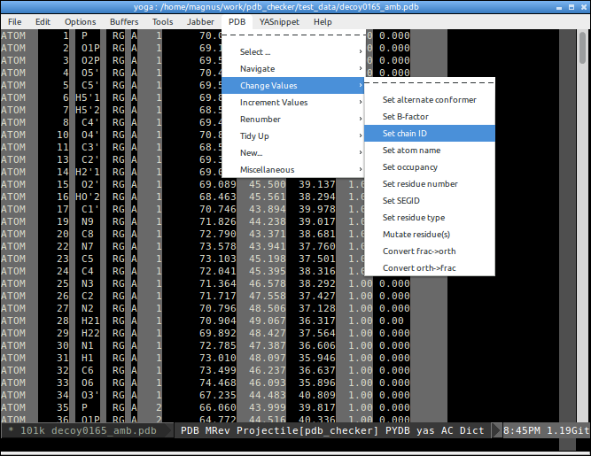
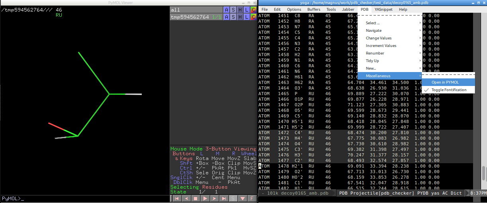

emacs-pdb
=========

pdb-mode is an emacs-lisp minor mode for Emacs to perform a number of useful editing functions on Protein DataBank (PDB) formatted files. XEmacs and/or GNU Emacs are available for most computing platforms.

Read more on implemented functions https://crystal.scb.uwa.edu.au/charlie/software/pdb-mode/

(@mmagnus: I'm not an author of this code, I just updated it slightly, fixed it in 2020, all credits go to Charlie Bond & David Love, I asked Charles S. Bond if I can share it and he was OK with that ;-)

## emacs-pdb-mode & rna-tools

rna-tools can be used side-by-side https://github.com/mmagnus/emacs-pdb-mode to edit files structural files in the PDB format.

http://rna-tools.readthedocs.io/en/latest/emacs.html

## Install
My installation config:

      ;; pdb.el
      (load-file "~/.emacs.d/plugins/pdb-mode/pdb-mode.el")
      (setq pdb-rasmol-name "/usr/bin/pymol")
      (setq auto-mode-alist
           (cons (cons "pdb$" 'pdb-mode) 
                 auto-mode-alist ) )
      (autoload 'pdb-mode "PDB")

## How to customize the colors?
You can play around with:

    (make-face 'pdb-key1-face)
    (set-face-background 'pdb-key1-face "dim gray")
    (make-face 'pdb-comment-face)
    (set-face-foreground 'pdb-comment-face "dark gray")

.. a full list of Emacs color you can get by typing `M-x list-colors-display`.

Select a residue:

.. change Chain ID:

Send a part of the PDB file directly to PyMOL:

