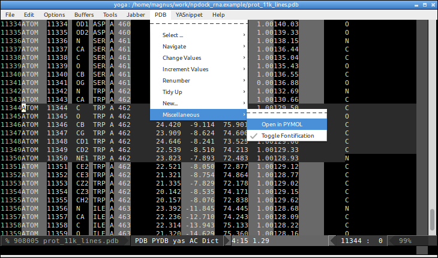

emacs-pdb
=========

pdb-mode is an emacs-lisp minor mode for Emacs to perform a number of useful editing functions on Protein DataBank (PDB) formatted files. XEmacs and/or GNU Emacs are available for most computing platforms.

## How to customize the colors?
You can play around with:

    (make-face 'pdb-key1-face)
    (set-face-background 'pdb-key1-face "dim gray")
    (make-face 'pdb-comment-face)
    (set-face-foreground 'pdb-comment-face "dark gray")

.. a full list of Emacs color you can get by typing `M-x list-colors-display`.

